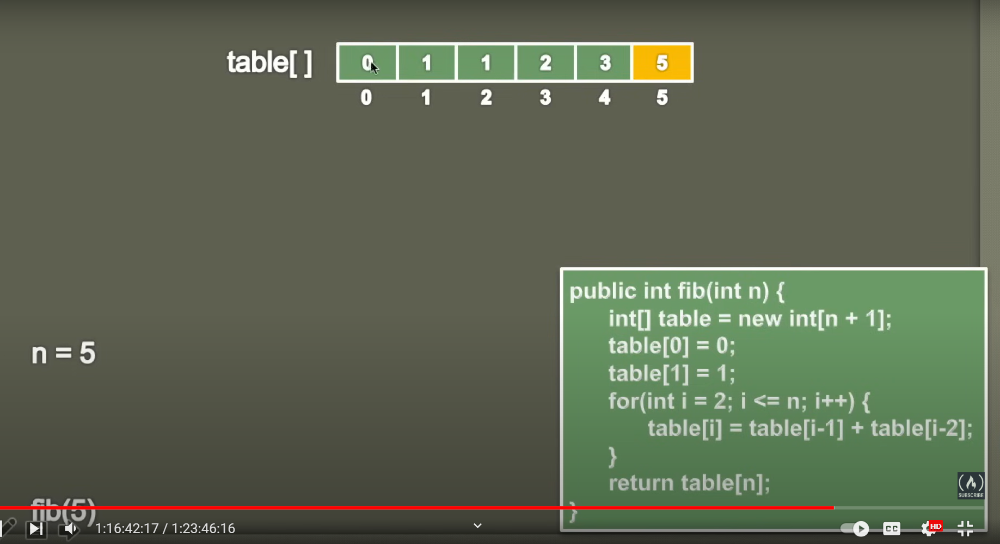
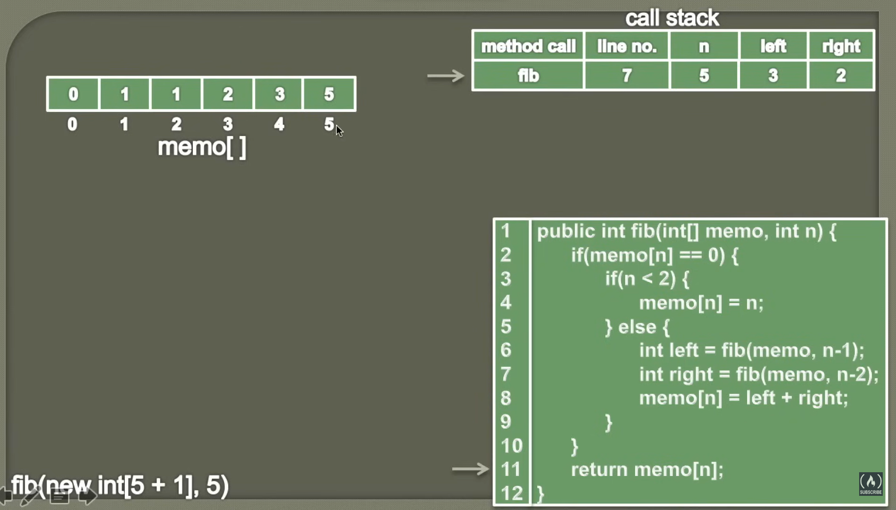

## Dynamic Programming

- It is a technique in which complex problem is solved by

  - Breaking it into smaller sub problems.
  - Solving those problem and simply storing there result.
  - Re-use those stored result if sub problems occurs/overlaps again. (Avoid solving sub problems again).
  - Finally using solutions to smaller problems build up solution to complex problem.

- It is mainly and optimization over recursion.
- Dynamic Programming = Recursion + Memorization.

## Dynamic Programming problem has few characteristic.

### 1. Optimal Substructure.

- A given problem has optimal Substructure Property if optimal solution of the given problem can be obtained by using the optimal solution of its sub problem.

- Example = fib(n) = fib(n-1) + fib(n-2);

### 2. Overlapping Subproblem.

- A given problem has Overlapping Subproblems Property if solution of the given problem is obtained by solving same subproblems multiple time.

- Example = fib(n) = fib(n-1) + fib(n-2);

## Approach to solve a dynamic programming

### 1. Bottom Up Approach

- We try to solve smaller sub problems first, use their solution to build on and arrive at solutions to bigger sub-problems.
- It is also called as tabulation method.
- The solution is build in a tabular form by using solutions of smaller sub-problems iteratively and generating solutions to bigger sub-problems.

### 2. Top Down Approach.

- It is also called as memoization.
- We break the large problems into multiple sub-problems.
- Each of the sub-problems are solved and solutions are remembered.
- If the sub-problem is solved already, reuse the answer.
- Else solve the subproblem and store the result.
- Thus, it memorizes the solution of the sub problem to avoid recomputing the value if sub-problem is encountered again.

