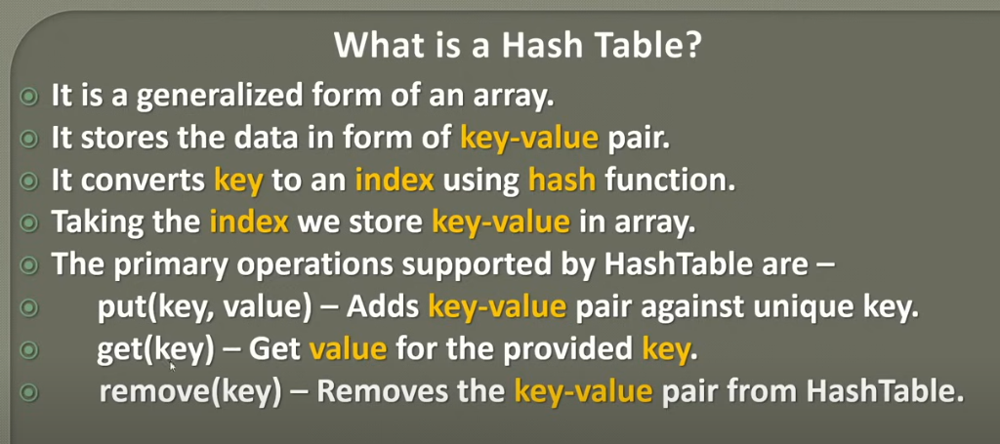
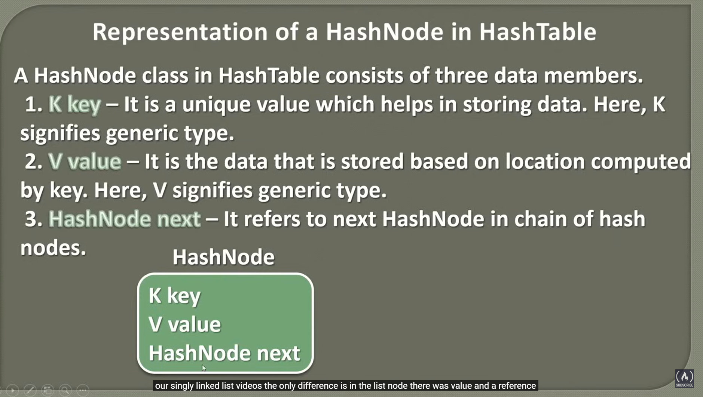
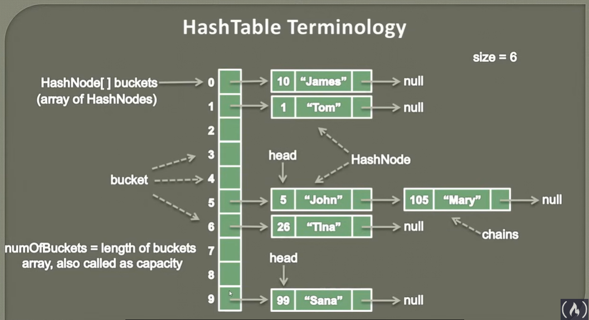

## Introduction to Hashing

### Search Operations
### Linear Search

- Approach: Compares the key with each element in an array.
- Time Complexity: O(n).

### Binary Search:

- Approach: Works on a sorted array, using a divide-and-conquer strategy.
- Time Complexity: O(log n).

### Array-based Direct Addressing:

- Approach: Maps keys directly to indices in an array.
- Time Complexity: O(1).
- Problem: Not suitable for large-sized keys (e.g., 12-digit Aadhaar card number) due to large array size and potential memory wastage.

## Hashing:

- Definition: Converts an arbitrary size key into a fixed size value.
- Hash Function: Converts a large key into a fixed size value that can be used as an index in an array.
- Example: If an array size is 1000, the hash function will convert a large key to a value between 0 and 1000.
  - Advantages of Hashing:
    - Efficient storage, retrieval, and removal of information.
    - Reduces potential memory wastage compared to direct addressing.

## Hash Function:

- Purpose: Converts an arbitrary size key into a fixed size value (index).
- Use: For storing, retrieving, and removing keys efficiently.

### Modular Hash Function:

- Definition: A function that takes a key and a size, then returns the remainder when the key is divided by the size.
- Calculation: key mod size.
- Purpose: Helps map large keys to a smaller fixed-size array.
- Usage:
  - Takes a large key, divides it by the size of the array, and returns the remainder.
  - This remainder is used as the index to store the key in the array.

**Example:**

- Array of size 10.
- Keys: 5, 1, 10, 26, 99.

**Hashing:**

- For key 5: 5 mod 10 = 5 → store at index 5.
- For key 1: 1 mod 10 = 1 → store at index 1.
- For key 10: 10 mod 10 = 0 → store at index 0.
- For key 26: 26 mod 10 = 6 → store at index 6.
- For key 99: 99 mod 10 = 9 → store at index 9.

**Usage in Searching:**

- To search for a key, apply the same hash function to the key.
- Compare the key with the value at the calculated index in the array.

**Collision:**

- Definition: Occurs when multiple keys hash to the same index.
- Example: If trying to store key 109, 109 mod 10 = 9, which is the same index as key 99.
- Problem: The array can only store one value at a time in each index.

## Separate chaining (collision)

Example Hash Table Setup:

Size: 10
Hash Function: key mod 10

Key-Value Pairs:

(5, John) at index 5
(1, Tom) at index 1
(10, James) at index 0 (10 mod 10 = 0)
(26, Tina) at index 6 (26 mod 10 = 6)
(99, Santa) at index 9 (99 mod 10 = 9)

Collision Example: (105, Mary) also hashes to index 5 (105 mod 10 = 5), where (5, John) is already stored.

Collision Resolution Technique: Separate Chaining:

**Separate Chaining: A method to handle collisions by storing collided elements in a list at the same index.**

Implementation:

- When a collision occurs, store the new key-value pair in a linked list at the collided index.
- Each index in the hash table points to a list (linked list) of key-value pairs.
Linked List Structure:
- Head: Starting point of the list.
- Nodes: Each node contains a key, a value, and a reference to the next node.
- End Node: Points to null.

**Example with Separate Chaining:**

- At index 5, initially store (5, John).
- When (105, Mary) collides at index 5:
- Create a new node for (105, Mary).
- Link this new node to the existing node (5, John) using the next reference.

**Advantages of Separate Chaining:**

Efficiently handles collisions by creating a chain of nodes at each index.
Ensures that all key-value pairs are stored even when collisions occur.

## What is a Hash table?

## HashNode

## HashNode Terminology

