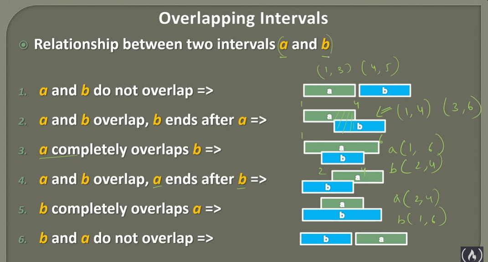

## Introduction to interval.

- An inteval is a range represented by two numbers like(5, 8).

- The two numbers are termed as start and end.

- Example - Time interval in tasks or job 

  - a => (1 , 3) , b => (4 , 5) , c => (8 , 10) , d => (9 , 11)

## Relation between intervals

