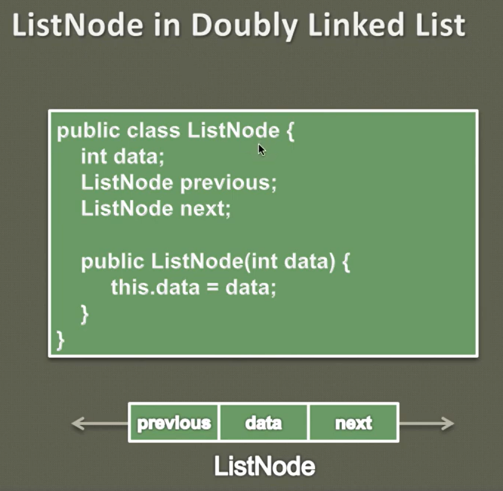
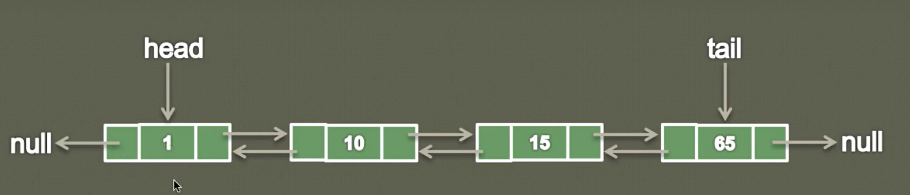

## Doubly Linked List

- It is called two way linked list.

- Given a node we can navigate list in both forward and backward direction, which is not possible in singly linked list.

- A node in Singly Linked List can only be deleted if we have a pointer to its previous node. But in doubly linked list we can delete the node even if we don't have pointer to its previous node.

