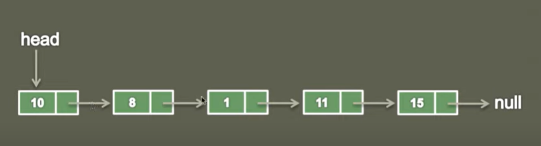

## Singly Linked List

Singly Linked List is a data struture used for storing collection of nodes and has following properties.

- It contains sequence of nodes.
- A node has data and reference to next node in a list.
- First node is the head node.
- Last node has data and points to null.

