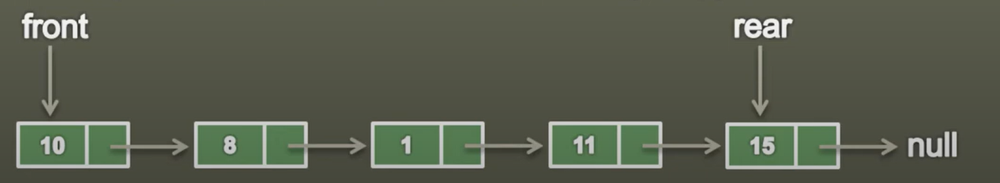

## Queue

- It is a linear data structure used for storing the data.

- It is an ordered list in which insertion are done at one end, called as rear and deletion are done at other end called as front.

- The first element inserted is the first one to be deleted. Hence, it is called as First In First Out(FIFO) list.

