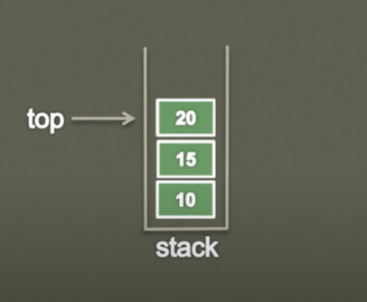

## Stack

- Stack is a linear data structure used for storing the data.

- It is an ordered list in which insertion and deletion are done at one end called as top.

- The last one inserted is the first one to be deleted. Hence it is called as Last In First Out(LIFO) list.

