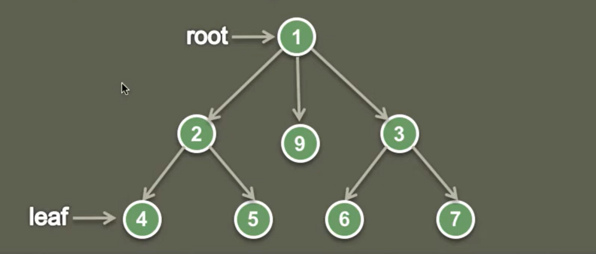
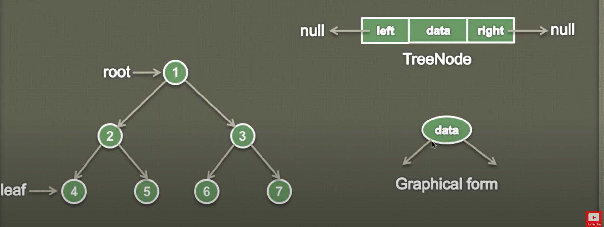

## What is a Tree?

- It is a non linear data structure used for storing data.

- It is made up of nodes and edges without having any cycle.

- Each node is a treee and can point to n number of nodes in a tree.

- It is a way of representing hierarchichal structure with a parent node called as root and many level of additional nodes.

## What is a Binary Tree?

- A tree is called as Binary Tree, if each node has zero, one or two children.

